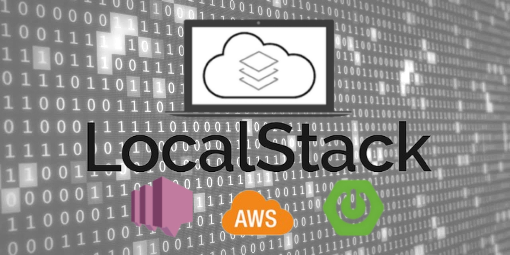
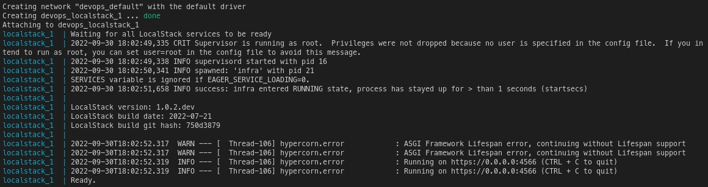
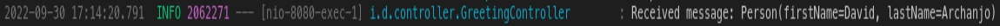

# INTRODUCTION
When building applications for the cloud, we need to be able to make test through and after the development phase in an environment minimally similar or ideally the same as the production environment where the application will run. We who develop for the AWS not always have an AWS account available in which we can simulate the environment, resources and/or services as we have in corporate projects.

With this problem in mind, [LocalStack](https://github.com/localstack/localstack) was conceived to be a way for testing and simulation for all the major AWS services like DynamoDB, SNS, SQS, Lambda we usually need to the development of applications designed to run in the cloud right from the confort of our local machine, where the application is being developed. LocalStack offers almost the same functionality, with some limitations, and APIs as the AWS cloud environment does.


# OBJECTIVES
This project intends to demonstrate the following three points:
- create a SNS topic on LocalStack (via command line)
- publish an event to a SNS topic (via command line)
- subscribe an endpoint from a REST application developed in Spring to consume events published in the SNS topic (via command line)


# PREREQUISITES
You should have the following technologies installed on your system:
- [docker-compose](https://docs.docker.com/compose/install/)
- [localstack](https://github.com/localstack/localstack)
- [awslocal](https://github.com/localstack/awscli-local)
- [java 14+](https://www.liquidweb.com/kb/how-to-install-java-windows-ubuntu-macos/)
- [gradle](https://gradle.org/install/)

**P.S.** In addition to these tools, you should have a basic understanding on [how to manipulate the command line interface (CLI)](https://www.linuxjournal.com/content/linux-command-line-interface-introduction-guide).


# TESTING
Open three terminal from the folder you downloaded or cloned the repository and go as follows:

## 1. START THE APPLICATION
From the first terminal, run:
```bash
./mvnw spring-boot:run
```

## 2. SNIP UP LOCALSTACK
From the second terminal, run:
```bash
docker-compose -f ./devops/docker-compose.yml up
```
You should get something like on the terminal:


## 3. SET ENDPOINT ADDRESS
From the third terminal, run:
```bash
ENDPOINT=http://host.docker.internal:8080
```
**P.S.** In order to be able to connect to services in the host machine from inside a container we should use `host.docker.internal` instead of `localhost` in the endpoint's address.

## 4. CREATE TOPIC
```bash
TOPIC_ARN=$(awslocal sns create-topic --name test-topic --output json | jq -r '.TopicArn')
```

## 5. SUSBSCRIBE ENDPOINT
```bash
awslocal sns subscribe --topic-arn $TOPIC_ARN --notification-endpoint $ENDPOINT --protocol http --attributes RawMessageDelivery=true
```

## 6. SEND MESSAGE
```bash
awslocal sns publish --topic-arn $TOPIC_ARN --message '{"firstName": "David", "lastName": "Archanjo"}'
```
From the first terminal in which the application is running, you should get something like the following:
